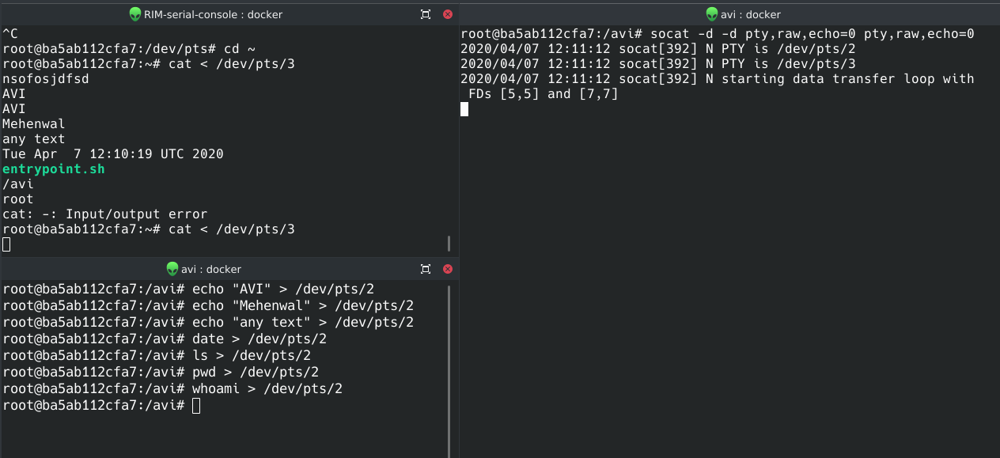
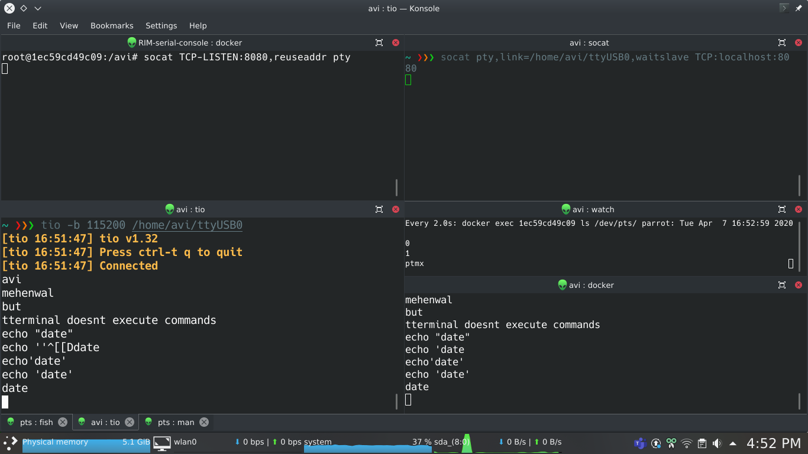

# Remote serial console

* [Link to my notes]()

```sh
docker build --tag avi/rim .
docker run -p 8080:8080 --interactive --tty avi/rim bash

socat pty,link=/home/avi/ttyUSB0,waitslave TCP:localhost:8080
tio -b 115200 /home/avi/ttyUSB0
watch --color --differences --beep --interval 2 'docker exec 4c4e615a7acf ls /dev/pts/'
docker exec 4c4e615a7acf cat /dev/pts/0
```

## Issue

```
curl: (1) Received HTTP/0.9 when not allowed
```

## Learning

1. Create new pseudoterminal
   1. `docker exec -it ba5ab112cfa7 bash`
   2. `ls /dev/pts`


## DEMO




## Resources

* https://stackoverflow.com/questions/46099874/how-can-i-forward-a-port-from-one-docker-container-to-another
*